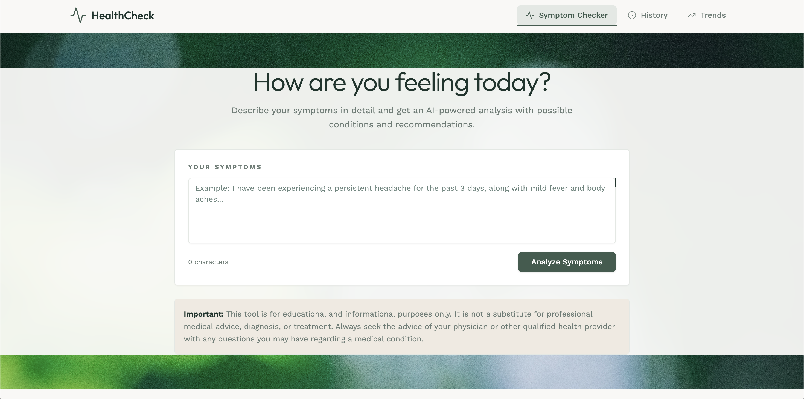
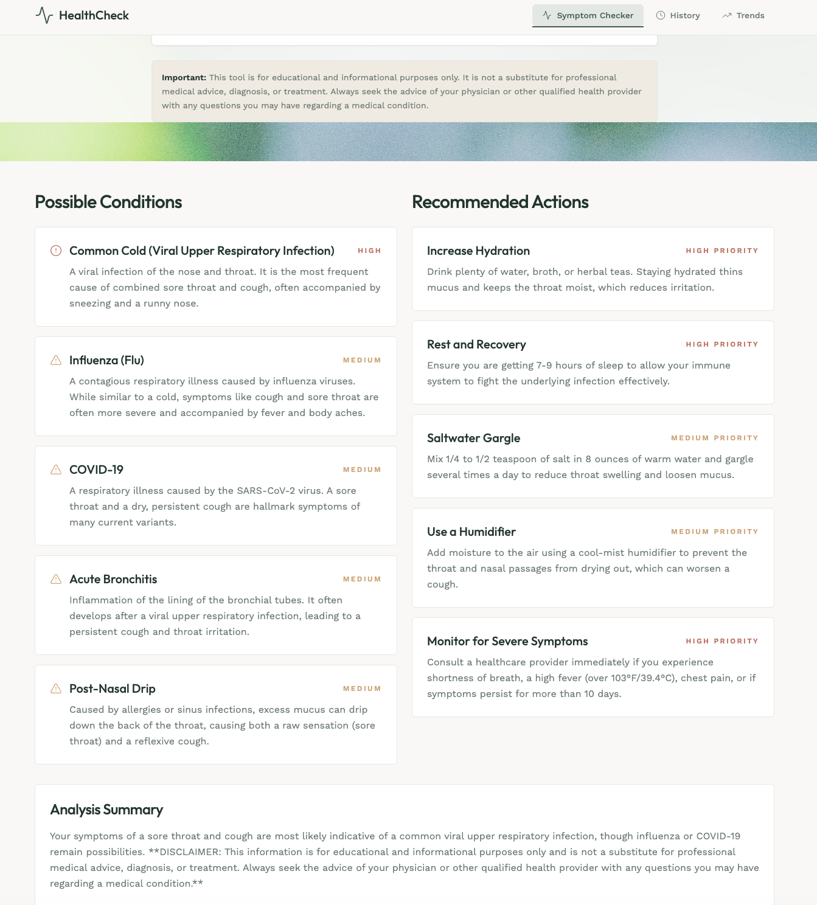
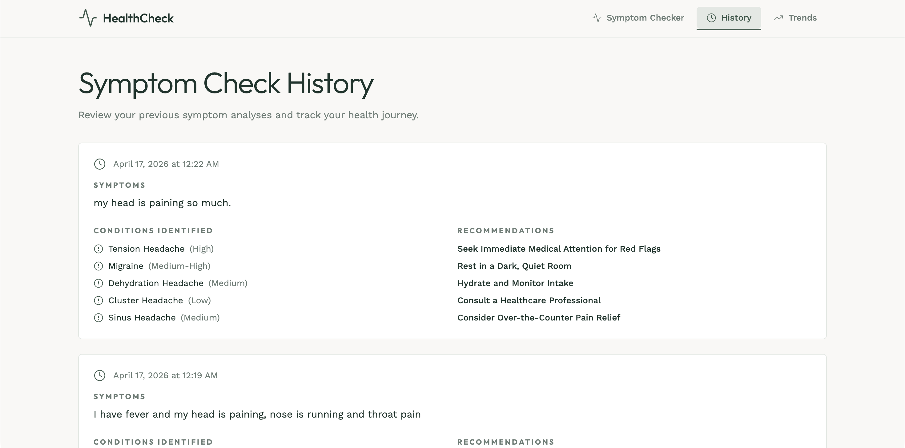
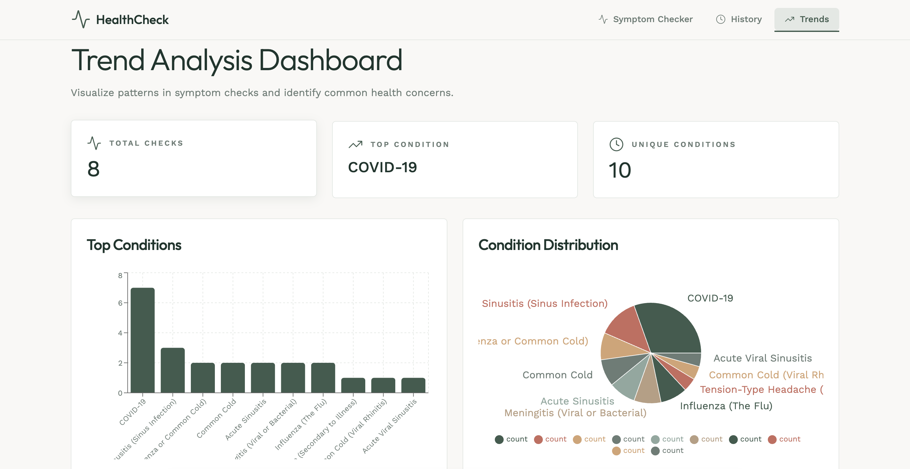
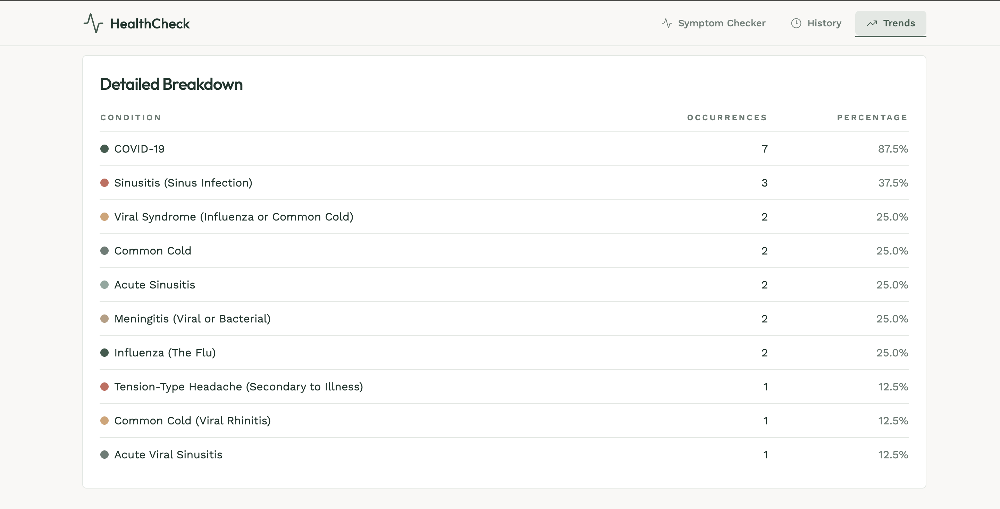

"# Healthcare Symptom Checker

An AI-powered symptom analysis application that helps users understand potential health conditions based on their symptoms. This tool uses Google Gemini AI to provide educational insights and recommendations.

## Features

- **Symptom Analysis**: Input your symptoms and receive AI-powered analysis of possible conditions
- **Detailed Recommendations**: Get actionable recommendations based on symptom analysis
- **Query History**: Track all your previous symptom checks
- **Trend Analysis Dashboard**: Visualize patterns in symptom checks with interactive charts
- **Educational Focus**: Clear disclaimers emphasizing educational purpose only

## Technology Stack

### Backend
- **Framework**: FastAPI
- **Database**: MongoDB with Motor (async driver)
- **LLM Integration**: Google Gemini 3 Flash
- **Language**: Python 3.11+

### Frontend
- **Framework**: React 19
- **Styling**: Tailwind CSS with custom design system
- **UI Components**: Shadcn/UI
- **Charts**: Recharts
- **Routing**: React Router v7
- **HTTP Client**: Axios


## Screenshots

### Symptom Input Page


### Symptom Result


### History Page


### Trend Analysis Dashboard


### Trends Page


## Setup Instructions

### Prerequisites
- Python 3.11+
- Node.js 18+
- MongoDB running on localhost:27017
- Google Gemini API key


### Backend Setup

1. Navigate to backend directory:
```bash
cd backend
```

2. Install dependencies:
```bash
pip install -r requirements.txt
```

3. Create a `.env` file (not included in repository):
```
Example:
MONGO_URL=\"mongodb://localhost:27017\"
DB_NAME=\"test_database\"
GEMINI_API_KEY=your_gemini_api_key_here
```

4. Start the backend server:
```bash
uvicorn server:app --host 0.0.0.0 --port 8001 --reload
```

### Frontend Setup

1. Navigate to frontend directory:
```bash
cd frontend
```

2. Install dependencies:
```bash
yarn install
```

3. Start the development server:
```bash
yarn start
```

## API Endpoints

### Symptom Analysis
- **POST** `/api/symptoms/analyze`
  - Body: `{ \"symptoms_text\": \"your symptoms description\" }`
  - Returns: Analysis with conditions and recommendations

### Symptom History
- **GET** `/api/symptoms/history`
  - Returns: List of all previous symptom checks

### Trend Analysis
- **GET** `/api/symptoms/trends`
  - Returns: Aggregated trend data and statistics

## Design Philosophy

The application follows an **Organic & Earthy** design archetype with:
- Calm, reassuring color palette (Sage Green primary)
- Clean typography (Outfit for headings, Work Sans for body)
- Micro-interactions for enhanced user experience
- Generous spacing and clear visual hierarchy
- Educational disclaimers prominently displayed

## Important Medical Disclaimer

⚠️ **This application is for educational and informational purposes only.**

It is NOT a substitute for professional medical advice, diagnosis, or treatment. Always seek the advice of your physician or other qualified health provider with any questions you may have regarding a medical condition.

## Project Structure

```
/Healthcare Symptom Checker
├── backend/
│   ├── server.py          # Main FastAPI application
│   
└── frontend/
    ├── public/
    │   └── index.html    # HTML template
    ├── src/
    │   ├── App.js        # Main application component
    │   ├── App.css       # Application styles
    │   ├── index.js      # React entry point
    │   ├── index.css     # Global styles with Tailwind
    │   ├── pages/
    │      ├── SymptomChecker.js  # Main symptom input page
    │      ├── History.js          # History view
    │      └── Trends.js           # Trend dashboard
    └── package.json      # Node dependencies
